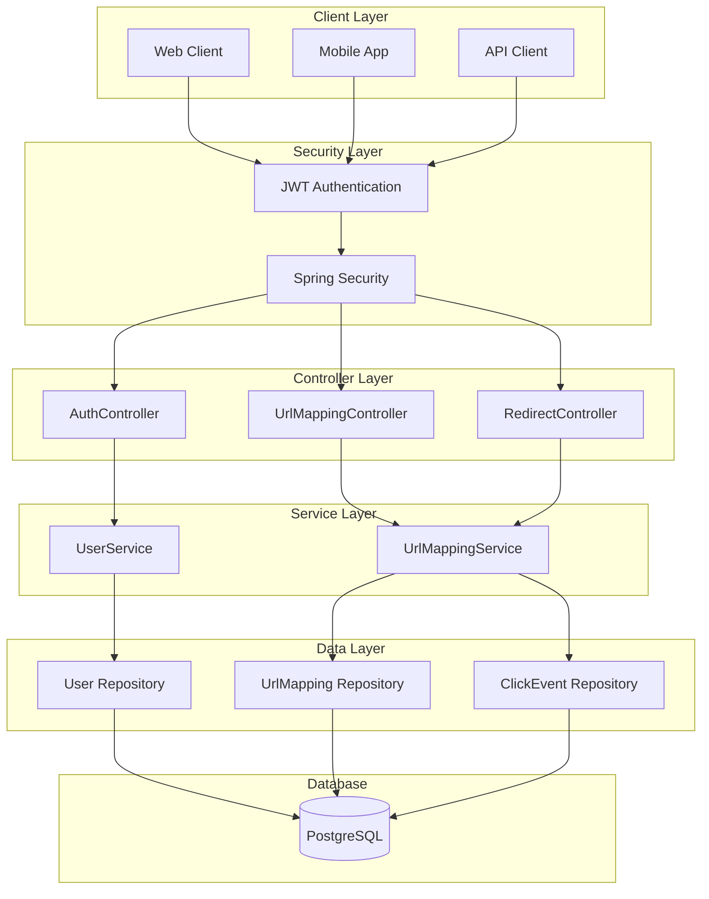

# 🔗 ByteURL - Advanced URL Shortener

<div align="center">


[](https://spring.io/projects/spring-boot)
[](https://openjdk.org/)
[](https://www.postgresql.org/)
[](https://jwt.io/)
[](https://www.docker.com/)

</div>

---

## 📋 Table of Contents

- [🎯 Overview](#-overview)
- [✨ Features](#-features)
- [🛠️ Tech Stack](#️-tech-stack)
- [🏗️ Architecture](#️-architecture)
- [🚀 Getting Started](#-getting-started)
- [📚 API Documentation](#-api-documentation)
- [🔐 Authentication](#-authentication)
- [📊 Analytics](#-analytics)
- [🐳 Docker Deployment](#-docker-deployment)
- [🤝 Contributing](#-contributing)
- [📄 License](#-license)

---

## 🎯 Overview

**ByteURL** is a modern, full-featured URL shortening service built with Spring Boot. It provides secure user authentication, comprehensive analytics, and a robust REST API for creating and managing shortened URLs.

### 🌟 Why ByteURL?

- **🔒 Secure**: JWT-based authentication with Spring Security
- **📈 Analytics**: Detailed click tracking and user analytics
- **⚡ Fast**: Optimized for high performance with JPA and PostgreSQL
- **🐳 Containerized**: Ready-to-deploy Docker configuration
- **📱 RESTful**: Clean API design following REST principles

---

## ✨ Features

### 🔐 User Management
- **User Registration & Login** with secure password hashing
- **JWT Token Authentication** for stateless security
- **Role-based Access Control** (RBAC)

### 🔗 URL Operations
- **Create Short URLs** from long URLs
- **Custom Short Codes** (auto-generated)
- **URL Validation** and sanitization
- **Instant Redirection** with 302 status codes

### 📊 Analytics & Tracking
- **Click Event Tracking** with timestamps
- **User-specific URL Management**
- **Date-range Analytics** for detailed insights
- **Total Clicks Aggregation** by date

### 🛡️ Security Features
- **Spring Security Integration**
- **CORS Configuration**
- **Input Validation** and sanitization
- **Secure Headers** implementation

---

## 🛠️ Tech Stack

<div align="center">

| Category | Technology | Version |
|----------|------------|---------|
| **Backend Framework** |  | 3.4.0 |
| **Language** |  | 23 |
| **Database** |  | Latest |
| **Security** |  | 6.x |
| **Authentication** |  | 0.12.6 |
| **ORM** |  | Latest |
| **Build Tool** |  | 3.x |
| **Containerization** |  | Latest |

</div>

---

## 🏗️ Architecture



---

## 🚀 Getting Started

### 📋 Prerequisites

- **Java 23** or higher
- **Maven 3.6+**
- **PostgreSQL 12+**
- **Docker** (optional)

### 🔧 Installation

1. **Clone the repository**
   ```bash
   git clone https://github.com/your-username/byteurl.git
   cd byteurl
   ```

2. **Configure Database**
   ```properties
   # application.properties
   spring.datasource.url=jdbc:postgresql://localhost:5432/url_shortener
   spring.datasource.username=your_username
   spring.datasource.password=your_password
   ```

3. **Build the project**
   ```bash
   ./mvnw clean install
   ```

4. **Run the application**
   ```bash
   ./mvnw spring-boot:run
   ```

The application will start on `http://localhost:8080`

### 🐳 Quick Start with Docker

```bash
# Build and run with Docker
docker build -t byteurl .
docker run -p 8080:8080 byteurl
```

---

## 📚 API Documentation

### 🔐 Authentication Endpoints

#### Register User
```http
POST /api/auth/public/register
Content-Type: application/json

{
  "username": "john_doe",
  "email": "john@example.com",
  "password": "securePassword123"
}
```

#### Login User
```http
POST /api/auth/public/login
Content-Type: application/json

{
  "username": "john_doe",
  "password": "securePassword123"
}
```

**Response:**
```json
{
  "token": "eyJhbGciOiJIUzI1NiIsInR5cCI6IkpXVCJ9...",
  "type": "Bearer",
  "username": "john_doe"
}
```

### 🔗 URL Management Endpoints

#### Create Short URL
```http
POST /api/urls/shorten
Authorization: Bearer <your_jwt_token>
Content-Type: application/json

{
  "originalUrl": "https://www.example.com/very/long/url"
}
```

**Response:**
```json
{
  "shortUrl": "QN7XOa0a",
  "originalUrl": "https://www.example.com/very/long/url",
  "createdAt": "2024-01-15T10:30:00",
  "clickCount": 0
}
```

#### Get User URLs
```http
GET /api/urls/myurls
Authorization: Bearer <your_jwt_token>
```

#### URL Analytics
```http
GET /api/urls/analytics/{shortUrl}?startDate=2024-01-01T00:00:00&endDate=2024-01-31T23:59:59
Authorization: Bearer <your_jwt_token>
```

### 🔄 Redirect Endpoint

#### Access Short URL
```http
GET /{shortUrl}
```
**Response:** `302 Redirect` to original URL

---

## 🔐 Authentication

ByteURL uses **JWT (JSON Web Tokens)** for stateless authentication:

1. **Register** or **Login** to receive a JWT token
2. **Include** the token in the `Authorization` header: `Bearer <token>`
3. **Access** protected endpoints with valid tokens

### Token Structure
```json
{
  "sub": "username",
  "iat": 1640995200,
  "exp": 1641081600,
  "authorities": ["ROLE_USER"]
}
```

---

## 📊 Analytics

### Click Tracking
- Every URL access is logged with timestamp
- IP address and user agent tracking
- Geographic location data (optional)

### Available Metrics
- **Total Clicks** per URL
- **Click Events** with date/time
- **User Activity** summaries
- **Date Range** analytics

### Sample Analytics Response
```json
{
  "2024-01-15": 25,
  "2024-01-16": 42,
  "2024-01-17": 18
}
```

---

## 🐳 Docker Deployment

### Multi-stage Docker Build

The project includes a multi-stage Dockerfile for optimized builds:

```dockerfile
# Build stage with JDK 23
FROM eclipse-temurin:23-jdk AS build
WORKDIR /app
COPY . .
RUN ./mvnw clean package -DskipTests

# Runtime stage with JRE 23
FROM eclipse-temurin:23-jre
WORKDIR /app
COPY --from=build /app/target/*.jar app.jar
EXPOSE 8080
ENTRYPOINT ["java", "-jar", "/app/app.jar"]
```

### Docker Compose Setup

```yaml
version: '3.8'
services:
  app:
    build: .
    ports:
      - "8080:8080"
    environment:
      - SPRING_DATASOURCE_URL=jdbc:postgresql://db:5432/url_shortener
    depends_on:
      - db
  
  db:
    image: postgres:15
    environment:
      POSTGRES_DB: url_shortener
      POSTGRES_USER: postgres
      POSTGRES_PASSWORD: password
    ports:
      - "5432:5432"
    volumes:
      - postgres_data:/var/lib/postgresql/data

volumes:
  postgres_data:
```

---

## 🧪 Testing

### Run Tests
```bash
./mvnw test
```

### Test Coverage
- **Unit Tests** for services and utilities
- **Integration Tests** for API endpoints
- **Security Tests** for authentication flows

---

## 🔧 Configuration

### Environment Variables

| Variable | Description | Default |
|----------|-------------|---------|
| `SPRING_DATASOURCE_URL` | Database connection URL | `jdbc:postgresql://localhost:5432/url_shortener` |
| `SPRING_DATASOURCE_USERNAME` | Database username | `postgres` |
| `SPRING_DATASOURCE_PASSWORD` | Database password | `password` |
| `JWT_SECRET` | JWT signing secret | Auto-generated |
| `JWT_EXPIRATION` | Token expiration (ms) | `86400000` (24h) |

---

## 🤝 Contributing

We welcome contributions! Please follow these steps:

1. **Fork** the repository
2. **Create** a feature branch (`git checkout -b feature/amazing-feature`)
3. **Commit** your changes (`git commit -m 'Add amazing feature'`)
4. **Push** to the branch (`git push origin feature/amazing-feature`)
5. **Open** a Pull Request

### Development Guidelines
- Follow **Java coding standards**
- Write **comprehensive tests**
- Update **documentation**
- Use **meaningful commit messages**

---


---

## 🙏 Acknowledgments

- **Spring Boot Team** for the amazing framework
- **JWT.io** for JWT implementation
- **PostgreSQL** for reliable database solutions
- **Docker** for containerization support

---

<div align="center">

</div>
